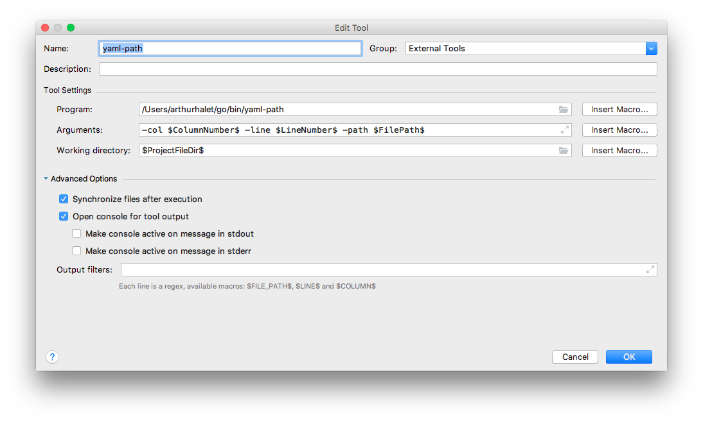

## What

`yaml-path` reads given yaml on stdin and output a sort of 'path' corresponding to given `line` and
`column` in the file.

Generated path is compilant with [BOSH](https://bosh.io/docs/cli-v2/) `ops-file` syntax.

## Usage

```
usage: yaml-path [<flags>]

Flags:
  -h, --help         Show context-sensitive help (also try --help-long and --help-man).
      --line=0       Cursor line
      --col=0        Cursor column
      --sep="/"      Set path separator
      --name="name"  Set attribut name, empty to disable
      --path=""      Set filepath, empty means stdin
      --version      Show application version.
```

## Example

Given the following yaml file:
```yaml
top:
  first:
    - name: myname
      attr1: val1
      attr2: val2
      #       ^
    - value2
    - value3
  second:
    child1: value1
    child1: value2
    child3: value3
```


```cat test.yaml | ./yaml-path --line 5 --col 14```

Outputs:
```
/top/first/name=myname/attr2
```

## Integration
### Emacs

Get a local copy of this repo :
```
git clone https://github.com/psycofdj/yaml-path.git
```

Install emacs `yaml-path` package:
```
cd emacs && make install
```

Provided functions:

- `yaml-path-at-point` : (interactive) display in minibuffer and store to kill ring yaml path for token under cursor
- `yaml-path-get-path-at-point(&optional line col)` : return yaml path for token in current buffer at given line and column
- `yaml-path-which-func`: integrates `yaml-path-get-path-at-point` with [which-function-mode](https://www.emacswiki.org/emacs/WhichFuncMode)

Demo:


### Vim

Install vim script (see the [README](./plugin/README.md)):
```
cat ./plugin/yaml-path.vim >> ~/.vimrc
```

Demo:


### Intellij

1. Go to preference -> tools -> external tools
2. Add a new one with this configuration




## Why ?

Working with [BOSH](https://bosh.io/docs/cli-v2/) often require to writes so-called `ops-file` which
are kind of patches for yaml files. Writing the path of the object to modify is a real burden in large
yaml files.

This tool is meant to be easily integrated in editor such as emacs.

## Note

The current implementation relies on a very savage hack of golang [yaml](https://github.com/go-yaml/yaml) 
library vendored in this project.

<!-- Local Variables: -->
<!-- End: -->
